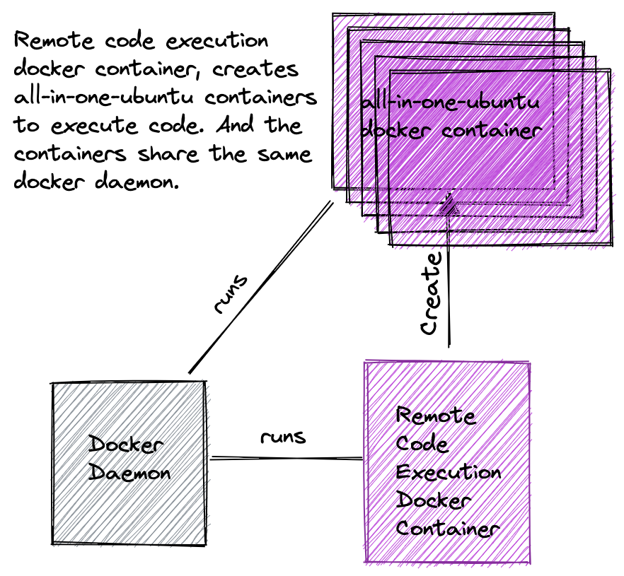

# Remote Code Execution

Run the application codes for multiple languages using very simple APIs.

Remote code execution application creates a container then executes the code gives the response to client. Current architecture does not use __DIND(Docker in Docker)__. The containers share the same docker daemon.



## Test the application

```bash
curl --location --request POST 'http://3.67.10.139:8888/v2/codexec' \
--header 'Content-Type: application/json' \
--data-raw '{
    "lang": "python3",
    "content": "import sys\ninp = sys.argv[1]\nfor i in range(int(inp)):\n\tprint('\''*'\'' * (i +1))",
    "args": [
        "20"
    ]
}'
```

## Getting Started

Follow the getting started steps to run the application.

### **or just run `make up`**

First change the mount source path in `dev.yml` and `local.yml` files.
Source path should be pointing to the path of `/target` folder in your application. You can use the bash command below if you're inside the application directory with the terminal.

```bash
source_path="$(pwd)/target"
echo $source_path
```

```yaml
mounts:
  - type: "bind"
    source: <source_path> # write the value here
    target: "/app"
```

Build the all-in-one-ubuntu image
```bash
docker build build/all-in-one-ubuntu -t all-in-one-ubuntu
```

### Run the application in your local

```bash
APP_ENV=local go run . serve
```

### Run the application using docker

Build the rce image
```bash
docker build --progress=plain -t rce -f dev.Dockerfile .
```

Run the container with the image you have created before.
```bash
docker run -it -p 8888:8888 -v /var/run/docker.sock:/var/run/docker.sock --mount type=bind,source=$(pwd)/target,target=/rce/target rce
```

## Build the all-in-one-ubuntu image

Build the ubuntu docker image to run code with different languages.

```bash
docker build build/all-in-one-ubuntu -t all-in-one-ubuntu
docker run -dit all-in-one-ubuntu
```

Open ubuntu container from command line.
```
docker ps # find the container id
docker exec -it <container-id> bash
```

Test the compiler/interpreters.

1. __Python -->__ `python3 --version`
2. __Java -->__ `java -version`
2. __Javac -->__ `javac -version`
3. __NodeJS -->__ `nodejs --version`
4. __Golang -->__ `/usr/local/go/bin/go version`
5. __C++ -->__ `g++ --version`
6. __C -->__ `gcc --version`

## Execute multiple commands with docker exec

The command below will work for ubuntu container. You need to change the `bash` command according to container you use. For example for alpine container it should be `/bin/sh`.

```bash
docker exec -w <workdir> -it <container-id> bash -c "<command> && <command>"
```

## Quick Demo

Clone the application, open the terminal and go to the application directory then run the commands below.

```bash
mkdir target
echo 'import package
import "fmt"
func main() {
    fmt.Println("Hello, world!")
}' > demo.go
go build -o rce .
APP_ENV=local ./rce exec -p demo.go -l golang
```

To kill the container and remove after that.
```bash
function conkill {
    docker kill $1
    docker container rm $1
}
conkill <container-id>
```
